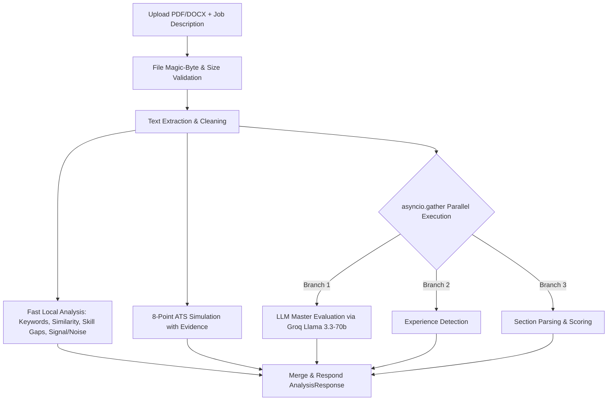

<div align="center">

# 🎯 CareerIQ

**AI-powered resume intelligence platform that optimizes your resume for ATS algorithms and lands you more interviews.**

[](https://fastapi.tiangolo.com)
[](https://react.dev)
[](https://vitejs.dev)
[](https://tailwindcss.com)
[](https://groq.com)
[](LICENSE)

</div>

---

## 🚀 Overview

Over **75% of job applications** are filtered out by Applicant Tracking Systems (ATS) before reaching human recruiters — often due to missing keywords, non-standard formatting, or unquantified achievements. 

**CareerIQ** bridges this gap by combining fast local NLP NLP algorithms with **Llama 3.3-70b AI intelligence**. Upload any PDF or DOCX resume alongside a target Job Description to get an immediate, actionable report.

---

## ✨ Features

- 📊 **Overall Fit & Semantic Score**: High-precision vector similarity matching using `all-MiniLM-L6-v2`.
- 🛡️ **8-Point ATS Simulation with Text Evidence**: Evaluates contact info, section headers, keyword density, dates, formatting, length, and quantification with concrete evidence snippets.
- 🎯 **Skill Gap Analysis**: Categorizes missing skills into *Critical*, *Important*, and *Optional* gaps with recommended courses.
- 🤖 **AI Career Coaching (Llama 3.3-70b)**:
  - *Bullet Rewriter*: Converts weak experience bullets into quantified, action-verb achievements.
  - *Interview Generator*: Produces role-tailored technical & behavioral interview questions.
  - *LinkedIn Optimizer*: Crafts keyword-dense, professional "About" sections.
- 💼 **Live Job Recommendations**: Real-time matching using the JSearch API based on candidate skills.
- 📜 **Persisted Analysis History**: LocalStorage-backed history allowing instant access to past reports.

---

## 🏗️ Architecture & Request Flow



---

## 🛠️ Quick Start (Local Setup)

### Prerequisites
- Python 3.10+
- Node.js 18+ & npm

### 1. Backend Setup
```bash
cd backend

# Create virtual environment
python -m venv venv
# On Windows: venv\Scripts\activate
# On Linux/macOS: source venv/bin/activate

# Install dependencies
pip install -r requirements.txt

# Configure environment variables
cp .env.example .env
# Edit .env and insert your GROQ_API_KEY and RAPIDAPI_KEY

# Start backend server
uvicorn main:app --reload --port 8000
```
Backend API interactive documentation will be available at [http://localhost:8000/docs](http://localhost:8000/docs).

### 2. Frontend Setup
```bash
cd frontend

# Install dependencies
npm install

# Configure environment variables
cp .env.example .env

# Start development server
npm run dev
```
Frontend app will be available at [http://localhost:5173](http://localhost:5173).

---

## 🌐 Production Deployment (Vercel + Render)

For full step-by-step instructions on deploying the frontend to **Vercel** and the backend to **Render/Koyeb**, see [DOCUMENTATION.md](DOCUMENTATION.md).

---

## 📄 License

This project is licensed under the MIT License.
