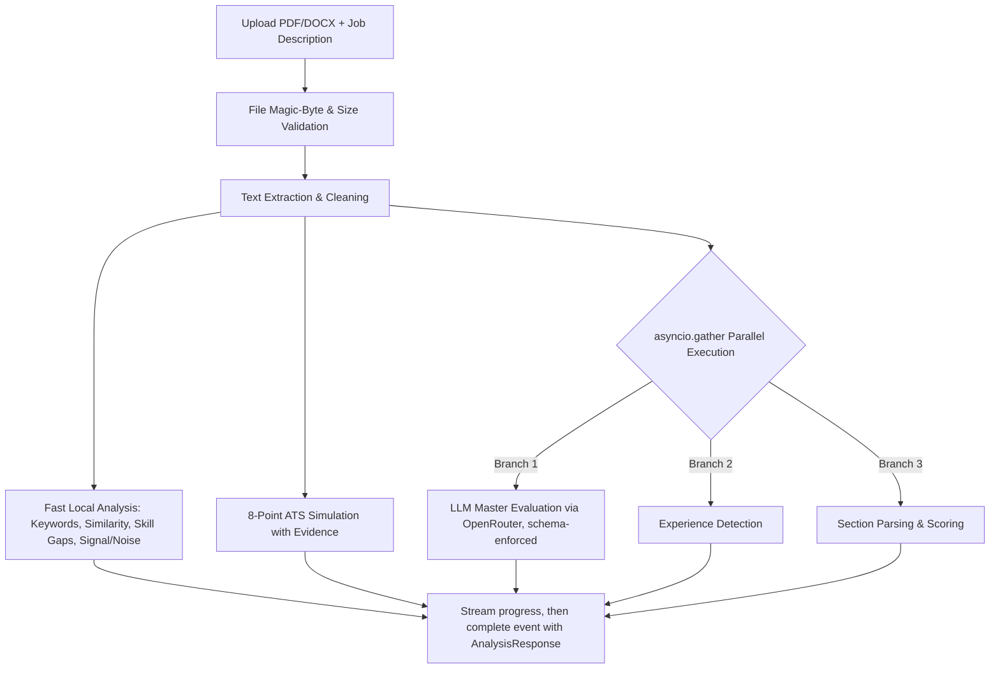

<div align="center">

# 🎯 CareerIQ

**AI-powered resume intelligence platform that optimizes your resume for ATS algorithms and lands you more interviews.**

[](https://fastapi.tiangolo.com)
[](https://react.dev)
[](https://vitejs.dev)
[](https://tailwindcss.com)
[](https://openrouter.ai)


</div>

---

## 🚀 Overview

Over **75% of job applications** are filtered out by Applicant Tracking Systems (ATS) before reaching human recruiters — often due to missing keywords, non-standard formatting, or unquantified achievements.

**CareerIQ** bridges this gap by combining fast local NLP with **schema-constrained LLM evaluation via OpenRouter**. Upload any PDF or DOCX resume alongside a target Job Description to get an immediate, actionable report.

---

## ✨ Features

- 📊 **Overall Fit & Semantic Score**: Dense vector similarity using `BAAI/bge-small-en-v1.5` via fastembed.
- 🛡️ **8-Point ATS Simulation with Text Evidence**: Evaluates contact info, section headers, keyword density, dates, formatting, length, and quantification with concrete evidence snippets.
- 🎯 **Skill Gap Analysis**: Categorizes missing skills into *Critical*, *Important*, and *Optional* gaps with recommended courses.
- 🔍 **Evidence-Weighted Skill Matching**: Separates skills you *demonstrate* in your experience from skills you merely *list*, because the latter are exactly what an interviewer probes.
- 🤖 **AI Career Coaching** (two on-demand modes):
  - *Improved bullet points*: Rewrites weak experience bullets with action verbs and impact.
  - *30-day skill roadmap*: A focused plan for the biggest gaps against the target role.
- 🗣️ **Interview Prep**: Role-tailored questions, generated as part of the analysis and shown in the report.
- 📡 **Streaming Progress**: The analysis endpoint emits Server-Sent Events, so the UI shows real stages instead of a spinner.
- 📜 **Persisted Analysis History**: LocalStorage-backed history allowing instant access to past reports.

---

## 🏗️ Architecture & Request Flow


```mermaid
flowchart TD
    A[Upload PDF/DOCX + Job Description] --> B[File Magic-Byte & Size Validation]
    B --> C[Text Extraction & Cleaning]
    C --> D[Fast Local Analysis: Keywords, Similarity, Skill Gaps, Signal/Noise]
    C --> E[8-Point ATS Simulation with Evidence]
    C --> F{asyncio.gather Parallel Execution}
    F -->|Branch 1| G[LLM Master Evaluation via OpenRouter, schema-enforced]
    F -->|Branch 2| H[Experience Detection]
    F -->|Branch 3| I[Section Parsing & Scoring]
    D --> J[Stream progress, then complete event with AnalysisResponse]
    E --> J
    G --> J
    H --> J
    I --> J
```

---

## 🛠️ Quick Start (Local Setup)

### Prerequisites
- Python 3.10+
- Node.js 18+ & npm
- [uv](https://docs.astral.sh/uv/) for Python dependency management

### 1. Backend Setup

`pyproject.toml` and `scripts/` live at the **repository root**, not in `backend/`.
Install from the root, then point the server at the app directory:

```bash
# From the repository root
uv sync

# Configure environment variables
cp backend/.env.example backend/.env
# Edit backend/.env and insert your OPENROUTER_API_KEY

# Start backend server
uv run uvicorn main:app --app-dir backend --reload --port 8000
```
Backend API interactive documentation will be available at [http://localhost:8000/docs](http://localhost:8000/docs).

> **Free OpenRouter models need an account setting, not just a key.** Enable both
> toggles at [openrouter.ai/settings/privacy](https://openrouter.ai/settings/privacy),
> or every model returns `404 No endpoints available`. See DOCUMENTATION.md.

### 2. Frontend Setup
```bash
cd frontend

# Install dependencies
npm install

# Configure environment variables
cp .env.example .env

# Start development server
npm run dev
```
Frontend app will be available at [http://localhost:5173](http://localhost:5173).

### 3. Tests & Checks
```bash
# From the repository root
uv run pytest          # backend test suite
uv run ruff check .    # lint

cd frontend
npm run typecheck      # tsc --noEmit
npm run build          # production build
```

---

## 📊 Evaluation Harness

`evals/` is the measurement instrument for pipeline and model changes — see
[evals/README.md](evals/README.md).

```bash
python evals/run.py    # deterministic pipeline only, no API key needed
```

---

## 🌐 Production Deployment (Vercel + Render)

For full step-by-step instructions on deploying the frontend to **Vercel** and the backend to **Render**, see [DOCUMENTATION.md](DOCUMENTATION.md).

---

## 📄 License

This project is licensed under the MIT License, as declared in `pyproject.toml`.
